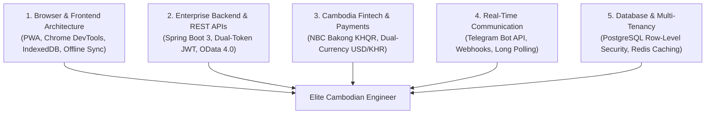
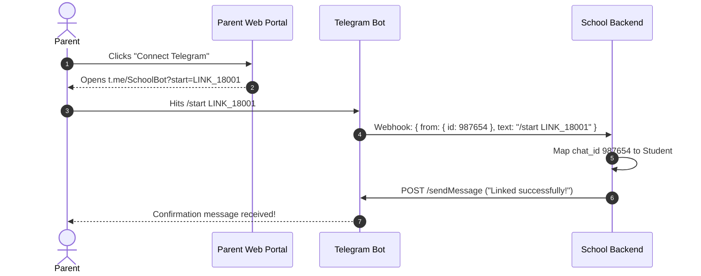

# Cambodia Enterprise Software Engineer & EdTech Product Roadmap

## Executive Overview
This skill provides the authoritative engineering blueprint and practical learning progression for software engineers in Cambodia building enterprise-grade SaaS platforms, universities/schools (AUPP, Western, Paragon, ITC tier), and high-reliability web applications.

---

## 1. The 5 Master Pillars of Cambodian Tech Dominance



---

## 2. Pillar 1: Chrome DevTools & Client-Side Architecture

Inspecting top-tier university portals (e.g. `www.aupp.edu.kh`) in the Chrome **Application Tab** reveals the client-side foundations every developer must master:

### 2.1. Progressive Web Apps (PWA) - `Manifest` & `Service workers`
* **Why it matters in Cambodia**: Eliminates the $99/year Apple developer fee and Google Play delays. Parents and teachers install the app directly from Chrome onto their Android or iOS home screens.
* **Key Components**:
  * `public/manifest.json`: Defines app identity, standalone display mode, orientation, and responsive icons (192px, 512px).
  * **Service Worker**: Intercepts HTTP fetch events to serve cached UI assets instantly on slow 3G mobile networks.

### 2.2. Storage Security Matrix: Cookies vs. LocalStorage

| Storage Mechanism | Purpose in Product | Security Standard |
| :--- | :--- | :--- |
| **`Cookies`** | **JWT Refresh Token (24 Hours)** | Flags mandatory: `HttpOnly; Secure; SameSite=Strict`. Inaccessible to JavaScript, preventing XSS token theft. |
| **`Local storage`** | **User Preferences** | `current_language` (`'km'` vs `'en'`), `active_branch_id`, theme (`'liquid-glass'`). |
| **`Session storage`** | **Transient Wizard State** | Multi-step student enrollment form data (discarded on tab close). |
| **`IndexedDB`** | **Offline Client Database** | Caches full student rosters and class schedules for offline use in rural/unstable connections. |

### 2.3. Background Sync & Web Push
* **Background Sync**: Allows a teacher to record attendance in an offline classroom. The browser queues the payload and automatically executes `POST /api/v1/attendance/batch-save` as soon as cellular data or Wi-Fi reconnects.
* **Web Push Messaging**: Browser-level alerts for grade publications and payment confirmations.

---

## 3. Pillar 2: Cambodia-Specific Fintech & Integrations 🇰🇭

### 3.1. NBC Bakong KHQR Integration (EMVCo Standard)
* **What is KHQR**: The unified national QR standard mandated by the National Bank of Cambodia (NBC).
* **Implementation Standard**:
  * Generate dynamic KHQR strings with Tag-Length-Value (TLV) encoding.
  * Tag `54` encodes transaction amount; Tag `53` encodes currency (`840` for USD, `116` for KHR).
  * Tag `63` contains CRC-16 checksum.
* **Webhook Reconciliation**: Secure callback from payment gateways (ABA PayWay, Wing, ACLEDA, Sathapana) verified via HMAC-SHA256 signatures before updating invoices.

### 3.2. Dual-Currency Accounting (USD & KHR)
* **Invariant #1**: NEVER use IEEE floating-point numbers (`float`/`double`). Always use `BigDecimal` or integer micro-units.
* **Exchange Rate Synchronization**: Store the exact NBC conversion rate active at the moment of invoice generation.
* **Closed Ledger Schema**:
  ```json
  {
    "tuitionFeeUSD": { "amount": 150.00, "currency": "USD" },
    "tuitionFeeKHR": { "amount": 615000, "currency": "KHR" },
    "exchangeRateApplied": 4100.00
  }
  ```

---

## 4. Pillar 3: Telegram Bot API as Primary Notification Hub

In Cambodia, Telegram is the primary communications tool for schools and businesses.



### The 3 Core Telegram Endpoints:
1. **Instant Alerts**: `POST https://api.telegram.org/bot<TOKEN>/sendMessage` (HTML/Markdown formatted absence or late notifications).
2. **Official Documents**: `POST https://api.telegram.org/bot<TOKEN>/sendDocument` (PDF tuition receipts, exam admit cards).
3. **Interactive Payment Prompts**: `POST https://api.telegram.org/bot<TOKEN>/sendPhoto` (Dynamic KHQR PNG + inline keyboard buttons).

---

## 5. Pillar 4: Enterprise REST APIs & Multi-Tenancy

Adhering to the project's [`enterprise-rest-api-standard`](file:///c:/Users/Students/Documents/ibecodemicroserveskill/.agents/skills/enterprise-rest-api-standard/SKILL.md):

* **Dual-Token Flow**:
  * `POST /api/v1/token/obtain/api_key/` $\rightarrow$ 1-Hour Access Token + 24-Hour Refresh Token.
  * `POST /api/v1/token/refresh/` $\rightarrow$ Rotates access token without user friction.
* **OData 4.0 Query Options**: `$select` for projections, `$expand` for relations, `$filter` with `any()`/`all()` lambdas, `$orderby`, `$top`, and `$skip`.
* **PostgreSQL Row-Level Security (RLS)**:
  * Multi-branch isolation (Phnom Penh vs Siem Reap vs Battambang) on a shared database instance.
  * Session guard: `SET LOCAL app.current_branch_id = '...'` prevents data leakage across branches.

---

## 6. Practical 6-Month Developer Mastery Roadmap

```
┌──────────┬─────────────────────────────┬────────────────────────────────────────────────────────┐
│ Timeline │ Focus Domain                │ Hands-On Milestone Project                             │
├──────────┼─────────────────────────────┼────────────────────────────────────────────────────────┤
│ Month 1  │ Client-Side & DevTools      │ Build installable PWA with manifest.json & offline CSS │
│ Month 2  │ Spring Boot REST & Auth     │ Implement Dual-Token JWT flow with Redis session store │
│ Month 3  │ PostgreSQL & Multi-Tenancy  │ Build schema with Row-Level Security (RLS) policies    │
│ Month 4  │ Bakong KHQR & Dual-Currency │ Generate dynamic KHQR & handle signed payment webhooks │
│ Month 5  │ Telegram Bot Service        │ Auto-dispatch attendance & PDF receipts via Telegram   │
│ Month 6  │ Docker & Cloud Deployment   │ Deploy multi-container stack to AWS/DigitalOcean SG    │
└──────────┴─────────────────────────────┴────────────────────────────────────────────────────────┘
```
