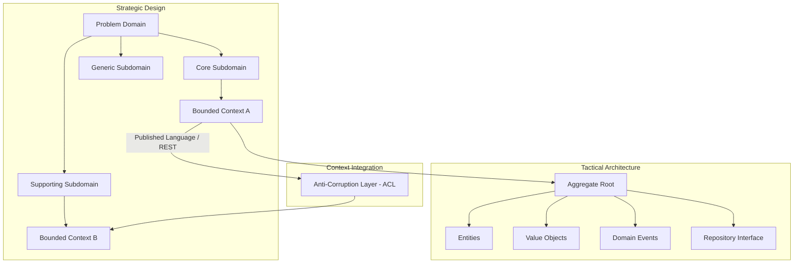
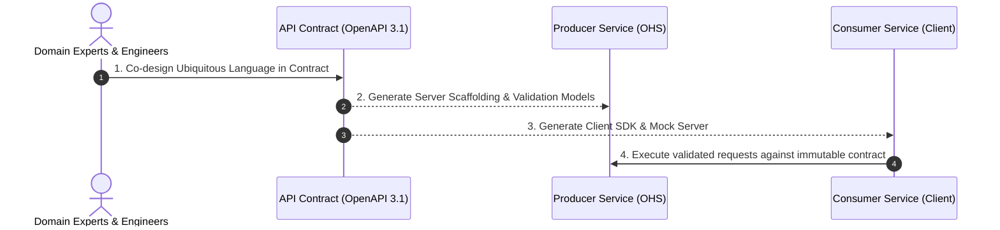

# Domain-Driven Design (DDD) Architecture & Empirical Research Framework

This skill provides an authoritative, academic-grade, and enterprise-ready framework for **Domain-Driven Design (DDD)**. It synthesizes empirical literature across core research questions (**RQ1–RQ7**), evaluates software quality attribute trade-offs (Monolith vs. Microservices), and defines practical guidelines for Strategic Design, Tactical Modeling, and API-First contract engineering.

---

## 1. Quality Attribute Evaluation: Monolith vs. Microservices

Before applying DDD to decompose or structure an architecture, the 6 primary software quality attributes must be balanced according to project maturity:

```
+-----------------------------------------------------------------------------------------+
|                                    ARCHITECTURAL SPECTRUM                                |
|  Modular Monolith                                                        Microservices  |
|  [Low Distributed Complexity] <---------------------------------> [Fine-Grained Elastic]  |
+-----------------------------------------------------------------------------------------+
```

| Quality Attribute | Modular Monolith (DDD In-Process) | Distributed Microservices (DDD Across Network) | Strategic Recommendation |
| :--- | :--- | :--- | :--- |
| **Complexity** | **Low to Moderate**<br>Single runtime, unified memory space, ACID database transactions, no network serialization overhead. | **High**<br>Distributed consensus, network latency/partitions, eventual consistency, distributed tracing, service discovery. | **Monolith for MVP / Early Stage** to minimize cognitive and operational tax. |
| **Changeability** | **High within modules**<br>Fast refactoring, compiler-enforced interfaces, but risk of architectural drift if boundaries bleed. | **High across domain boundaries**<br>Teams alter or rewrite services independently with distinct tech stacks. | **Microservices for multi-team scale** with established autonomous domain boundaries. |
| **Deployability** | **All-or-Nothing**<br>Deployment requires releasing the unified binary/container image; single pipeline bottleneck. | **Independent**<br>Continuous deployment per Bounded Context without taking down unrelated system capabilities. | **Microservices** when high-velocity independent releases are required. |
| **Scalability** | **Uniform Horizontal**<br>Scale by running additional full instances behind a load balancer (coarse-grained compute allocation). | **Fine-Grained Elasticity**<br>Scale compute/memory only for bottleneck services (e.g., payment, streaming, analytics). | **Microservices** when specific subdomains have divergent traffic profiles. |
| **Reliability** | **Shared Fate**<br>A catastrophic memory leak, blocking thread, or unhandled panic can bring down the entire process. | **Fault Isolation**<br>Circuit Breakers, bulkheads, and timeouts isolate failures; unaffected domains stay online. | **Microservices**, provided distributed resilience (Retry, Fallback, Dead-Letter) is implemented. |
| **Testability** | **Rapid & Deterministic**<br>In-memory integration tests with local test containers; rapid feedback loop. | **Complex Integration Verification**<br>Requires Consumer-Driven Contract Testing (Pact), service virtualization, and mock servers. | **Monolith** allows significantly faster local testing and CI test suite turnaround. |

---

## 2. Systematic Answers to DDD Research Questions (RQ1–RQ7)

### RQ1: State of the Art in Existing Literature
- **Study Types**: Primary literature comprises empirical case studies (45%), experience reports from enterprise modernizations (30%), design science research (15%), and systematic/multivocal mapping studies (10%).
- **Research Venues**: Premier software engineering and architecture venues:
  - IEEE/ACM International Conference on Software Engineering (ICSE)
  - International Conference on Software Architecture (ICSA / WICSA)
  - European Conference on Software Architecture (ECSA)
  - ACM Joint European Software Engineering Conference and Symposium on the Foundations of Software Engineering (ESEC/FSE)
  - Journal of Systems and Software (JSS) and IEEE Software.
- **Academic vs. Industrial Distribution**: Heavy industrial bias (~70% industrial experience and consultancy literature, ~30% academic formalization). Industry pioneers (Eric Evans, Vaughn Vernon, Martin Fowler) drove adoption prior to academic validation.

### RQ2: Categories of Software Systems Benefiting from DDD
1. **High-Regulation & Financial Systems**: Core banking, insurance underwriting, fintech ledger management where domain rules and double-entry invariants are strictly non-negotiable.
2. **Complex Lifecycle Enterprise Platforms**: ERPs, Campus & School Management Systems (SMS), Hospital Information Systems (HIS/EHR), and Supply Chain Orchestrations.
3. **High-Throughput eCommerce & Logistics**: Dynamic pricing engines, inventory reservations, order fulfillment pipelines.
4. **Cloud-Native SaaS with Multi-Tenancy**: Systems requiring strict tenant isolation combined with domain feature gating.

### RQ3: Software Development Concerns Addressed by DDD
- **Linguistic Ambiguity & Semantic Disconnect**: Eradicates translational misunderstandings between business domain experts and software engineers through **Ubiquitous Language**.
- **Accidental Complexity & Anemic Domain Models**: Relocates procedural business logic from sprawling controller/service classes into rich, self-validating **Entities and Value Objects**.
- **Spaghetti Coupling & Monolithic Tangling**: Segregates business concerns into clean **Subdomains** (Core, Supporting, Generic) and **Bounded Contexts**.
- **Distributed Data Inconsistency**: Resolves transaction sprawl through clearly demarcated **Aggregate Roots** and asynchronous **Domain Events**.

### RQ4: Common DDD Patterns in Research & Practice



1. **Strategic Patterns**:
   - **Bounded Context**: An explicit boundary within which a particular domain model applies and all terms in the Ubiquitous Language have a single, unambiguous meaning.
   - **Context Map**: Visual representation of relationships between contexts (Shared Kernel, Customer-Supplier, Conformist, Open Host Service / Published Language, Separate Ways).
   - **Anti-Corruption Layer (ACL)**: A translation adapter placed between a clean downstream model and a legacy/third-party upstream service to prevent external conceptual leakage.
2. **Tactical Patterns**:
   - **Entity**: An object with a distinct, enduring identity that persists across state changes (e.g., `StudentID`, `InvoiceNumber`).
   - **Value Object**: An immutable object defined entirely by its attributes without conceptual identity (e.g., `Money(amount, currency)`, `DateRange(start, end)`).
   - **Aggregate & Aggregate Root (AR)**: A boundary of entities and value objects treated as a single transactional unit, where external references are allowed only to the Root.
   - **Domain Event**: An immutable record of an event that has occurred within the domain (`EnrollmentConfirmed`, `FeePaymentCollected`).
   - **Repository Interface**: Abstraction over persistence mechanisms, defined in the domain layer and implemented in the infrastructure layer.

### RQ5: Implementation Challenges in DDD Projects
1. **Conflating Tactical with Strategic**: Teams prematurely implement tactical artifacts (Repositories, Entities) while neglecting the foundational strategic decomposition (Bounded Contexts and Context Mapping).
2. **Over-Granular Aggregate Roots**: Creating massive aggregates (e.g., whole school as an aggregate) causing database locking and performance bottlenecks, or micro-aggregates causing invariant loss.
3. **Scarcity of Business Domain Experts**: Engineering teams often lack sustained access to real domain experts, resulting in speculative domain modeling.
4. **Distributed Transaction Complexities**: Transitioning from ACID transactions to Eventual Consistency requires implementing complex Saga and Outbox patterns.
5. **Organizational Resistance (Conway's Law)**: Domain boundary decomposition fails if the organizational reporting hierarchy does not match the bounded contexts.

### RQ6: Measuring DDD Effectiveness in Prior Studies
- **Structural Cohesion & Coupling Metrics**:
  - Lack of Cohesion in Methods (LCOM)
  - Afferent Coupling ($C_a$) and Efferent Coupling ($C_e$)
  - Martin's Instability Index ($I = C_e / (C_a + C_e)$) and Abstractness ($A$)
- **DORA Delivery Metrics**:
  - Lead Time for Changes (measuring isolated deployments per Bounded Context)
  - Deployment Frequency
  - Mean Time to Restore (MTTR)
- **Defect Density & Blast Radius**:
  - Reduction of cross-module side-effect bugs after establishing Bounded Contexts.
- **Cognitive Load Assessments**:
  - Qualitative surveys on developer onboarding duration and domain code readability.

### RQ7: Key Stakeholders & Collaborative Dynamics
- **Domain Experts**: Define business rules, constraints, edge cases, and terminology.
- **Enterprise / Solution Architects**: Formulate Context Maps, integration protocols (ACL, OHS), and cross-cutting security/governance.
- **Software Engineers / Tech Leads**: Translate ubiquitous terminology into code aggregates, value objects, and automated tests.
- **Product Owners / Business Analysts**: Direct feature development based on Core vs. Supporting Subdomain return-on-investment (ROI).

---

## 3. API-First Architecture as DDD Published Language

The **API-First** development paradigm operationalizes DDD's **Published Language (PL)** and **Open Host Service (OHS)** concepts.



### Directives for API-First DDD Integration
1. **Contract as the Single Source of Truth**: The OpenAPI (OAS 3.1) or AsyncAPI specification must be established and reviewed before implementation begins.
2. **Schema-Enforced Ubiquitous Language**: Terminology used in API routes, field names, and error payloads must exactly match the Bounded Context vocabulary.
3. **Consumer-Driven Contract Testing (CDCT)**:
   - Use tools like **Pact** to verify that provider changes do not break downstream consumer assumptions.
4. **Idempotency & Eventual Consistency**:
   - All mutating REST endpoints must support idempotency keys (`Idempotency-Key: <UUID>`).
   - Domain events emitted across services must follow the **Transactional Outbox Pattern** to prevent dual-write inconsistencies between database updates and message broker publishes.

---

## 4. Event Storming & Strategic to Tactical Pipeline (Kudssi, Chicago TechFest)

To transform business requirements into microservices without falling into architectural traps, execute the 6-step Event Storming protocol:

```
┌────────────────────────────────────────────────────────────────────────────────────────────────────────┐
│                                       EVENT STORMING WORKSHOP FLOW                                     │
├────────────────────────────────────────────────────────────────────────────────────────────────────────┤
│ [1. Orange Sticky]   Domain Events: Past-tense verbs (e.g., "PaymentReceived", "AdmitCardIssued")     │
│ [2. Blue Sticky]     Commands: Triggers before each event (e.g., "SubmitPayment", "GenerateAdmitCard") │
│ [3. Lilac Sticky]    Business Processes: Policies triggered by events connecting commands with arrows  │
│ [4. Roles Identified]Actors & personas initiating the command (e.g., "Parent", "Accountant", "Dean")   │
│ [5. Yellow Sticky]   Entities & Aggregates: Cluster state and invariants around commands               │
│ [6. Boundaries Drawn]Group aggregates into Bounded Contexts (Core, Supporting, Generic)                │
└────────────────────────────────────────────────────────────────────────────────────────────────────────┘
```

### Subdomain Taxonomy
1. **Core Domain:** Highest strategic investment, competitive edge, built by top senior engineers (e.g., *Campus Lifecycle, Academic Evaluation, Dynamic Tuition Engine*).
2. **Supporting Subdomain:** Complements core business, custom-developed because off-the-shelf does not fit (e.g., *Hostel Bed Management, Bus Route GPS Optimizer*).
3. **Generic Subdomain:** Commodity software; purchased off-the-shelf or built using standard libraries (e.g., *Email/SMS Gateway, Generic File Storage, Payment Rail Connectors*).

---

## 5. The 4 Fundamental Aggregate Design Rules (Kudssi / Vernon)

1. **Rule 1: Design Small Aggregates:**
   * Avoid large "God Aggregates". Large aggregates lead to excessive database locks, high concurrency conflicts, and degraded performance.
   * Enforce Single Responsibility Principle: each aggregate maintains a single cluster of invariants.
2. **Rule 2: Protect Business Invariants inside Aggregate Boundaries:**
   * Business rules and data validation MUST reside inside the Aggregate Root.
   * **Anti-Pattern (Anemic Domain Model):** Avoid creating domain classes that are mere data bags with empty getters/setters while business logic leaks into service classes.
   * **Anti-Pattern (Service Layer Leaks):** Do not let transaction coordination services hijack domain validation logic.
3. **Rule 3: Reference Other Aggregates by Identity Only:**
   * Never hold direct object references across Aggregate Roots (e.g., `Order` must hold `customerId: UUID`, NOT `Customer customer`).
   * Prevents memory bloat, avoids cascading eager-load queries, and makes distributed extraction into independent microservices trivial.
4. **Rule 4: Update Other Aggregates Using Eventual Consistency:**
   * An aggregate transaction must mutate **only one aggregate instance** per business transaction.
   * Cross-aggregate state updates must propagate asynchronously via Domain Events and messaging brokers (Kafka/RabbitMQ).

---

## 6. Context Mapping Strategies: 7 Integration Relationships

```
┌──────────────────┐               Relationship                ┌──────────────────┐
│ Upstream (U)     │ ────────────────────────────────────────> │ Downstream (D)   │
└──────────────────┘                                           └──────────────────┘
```
* **Partnership:** Two teams align dependent goals and synchronize continuous integration.
* **Shared Kernel:** Teams share an explicit, small subset of the domain model (requires constant agreement).
* **Customer-Supplier:** Upstream (U) holds sway; downstream (D) requests features and plans around upstream deliverables.
* **Conformist:** Upstream has no motivation to support downstream; downstream conforms strictly to upstream models (e.g., public cloud APIs, payment gateways).
* **Anticorruption Layer (ACL):** Downstream implements a defensive translation adapter to isolate internal models from external/legacy models.
* **Open Host Service (OHS) & Published Language (PL):** Upstream defines and publishes a standard, versioned API/Schema (OpenAPI/JSON Schema) for multiple consumers.
* **Separate Ways:** Integration provides zero payoff; teams build independent solutions without sharing domain models.
* **Big Ball of Mud:** Uncontrolled, entangled dependencies. *Must be avoided at all costs.*

---

## 7. Practical Implementation Checklist for Architects

- [ ] **Define Ubiquitous Language Glossary**: Establish an approved markdown glossary of domain terms shared by business and tech.
- [ ] **Categorize Subdomains**:
  - **Core Domain**: Proprietary competitive advantage (invest most effort).
  - **Supporting Domain**: Custom-built complement to core business logic.
  - **Generic Domain**: Standard commodity software (off-the-shelf or standard library).
- [ ] **Draw Context Map**: Classify all integrations (ACL, Shared Kernel, OHS, Conformist, Separate Ways).
- [ ] **Enforce 4 Aggregate Rules**:
  - [ ] Small aggregates.
  - [ ] Business invariants protected inside root.
  - [ ] Reference other aggregates by `UUID` only.
  - [ ] Cross-aggregate mutations use domain events (Eventual Consistency).
- [ ] **Eliminate Anemic Models**: Domain entities contain rich behavioral methods; no public bare setters.
- [ ] **Decouple Infrastructure**: Clean/Hexagonal Architecture (Ports & Adapters) — domain entities never import Spring, Hibernate, or HTTP dependencies.
- [ ] **Enforce Transactional Outbox**: Store domain events in `outbox_events` table in the same ACID commit as state changes before Kafka dispatch.
