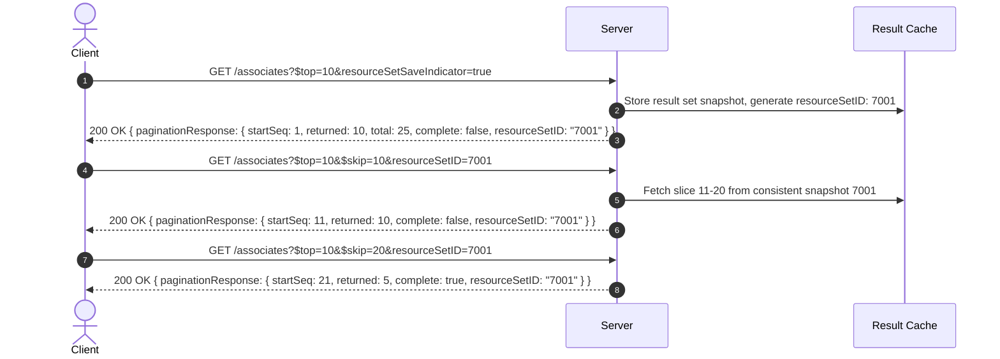

# Authoritative Enterprise RESTful Web API Design Standard
## Comprehensive Synthesis: WSO2, OAGi (Open Applications Group v2.0), N2WS CPM, and MAP

---

## 1. Kid-Friendly Mental Model: The Magic Lego Castle Robot 🧸🏰

If you ever need to explain how a massive distributed enterprise REST API works to an 8-year-old or a non-technical stakeholder, use this metaphor:

### The Story:
* **The Magic Lego Castle**: Imagine you spent weeks building the greatest Lego kingdom in your room. But you have an energetic puppy who might knock it over!
* **The Helper Robot (API Server)**: You have a robot butler standing at the door. You never let visitors touch the castle directly; they must ask the robot butler using clear notes (HTTP Requests).
* **The Magic 3D Camera (Snapshots & Backups)**: Every hour, the robot snaps a magic picture. If the castle gets smashed, you hand the robot a card that says `POST /recover/`. The robot waves a wand, and *POOF!* The entire castle rebuilds itself in 10 seconds flat!
* **The Glowing Wristbands (Dual-Token Security)**:
  * You show your secret family badge (**Permanent API Key**).
  * The robot gives you a glowing **Yellow Wristband (Access Token)** that shines for **1 hour**. You wear it to ask for toys.
  * When the yellow band stops glowing, you don't wake up your parents—you tap your **Green Wristband (Refresh Token, 24 hours)** against the robot to instantly get a shiny new yellow wristband!
* **The Toy Box Rule (Pagination & Filtering)**: If you ask for your toys, the robot doesn't dump all 10,000 toys on your head! You ask: *"Give me 10 toys at a time (`$top=10`), skipping the first 20 (`$skip=20`), only the blue spaceships (`$filter=color eq 'blue'`), sorted from newest to oldest (`$orderby=builtDate desc`)"*.
* **Freezing Old Toys (Storage Tiers)**: Toys you play with today stay on the desk (**Hot EBS**). Toys you might want next month go into labeled boxes in the attic (**Warm S3**). Toys you won't need until high school go into deep freezer blocks of ice (**Glacier Freezer**), where they cost zero pennies to keep!

---

## 2. Fundamental Resource Taxonomy & Architectural Archetypes

Following the WSO2 (Leymann et al.) and OAGi architectural specifications, REST resources fall into distinct archetypes rather than flat database tables:

```
┌───────────────────────────────┬──────────────────────────────────────────────────────────────┬───────────────────────────────────────────────────────┐
│ Resource Archetype            │ Semantics & Intent                                           │ Canonical Example URI                                 │
├───────────────────────────────┼──────────────────────────────────────────────────────────────┼───────────────────────────────────────────────────────┤
│ 1. Atomic Resource            │ Independent business entity exchanged as an indivisible unit │ GET /hr/v1/associates/{id}                            │
│ 2. Collection Resource        │ Server-managed directory/set; serves as a factory for items   │ GET /hr/v1/associates                                 │
│ 3. Scoped Collection          │ Collection whose existence is bound to a parent resource     │ GET /hr/v1/shopping-carts/{cartId}/items              │
│ 4. Composite Resource         │ Aggregate root manipulated as a whole (e.g., cart + items)   │ GET /sales/v1/orders/{id}                             │
│ 5. Controller Resource        │ Procedural / transactional operator that modifies state      │ POST /hr/v1/associates/{id}/hire                      │
│ 6. Processing Function Res.   │ Algorithmic computation or predefined partial update         │ POST /finance/v1/currencies/USD/convert               │
│ 7. Dynamic Instance Set       │ Transient subset saved for read-consistent pagination or PII │ POST /hr/v1/associates/save-resource-set              │
└───────────────────────────────┴──────────────────────────────────────────────────────────────┴───────────────────────────────────────────────────────┘
```

### Golden Rule of URI Naming (OAGi & WSO2):
* **Nouns for Entities**: Atomic, Collection, and Composite resources MUST be nouns (`associates`, `students`, `policies`).
* **Plural Collections, Singular Instances**: Collections use plural nouns (`/devices`); instances use IDs (`/devices/123`).
* **Verbs for Controllers & Processing Functions**: Procedural actions MUST be verbs and MUST appear as the **terminal path segment** (`/orders/{id}/cancel`, `/currencies/USD/convert`).
* **Strict Kebab-Case**: All path segments MUST use lowercase letters separated by hyphens `-`. Never use underscores `_` (hidden by browser hyperlink underlines) or `camelCase`.
* **No Trailing Slash**: A trailing forward slash `/` MUST NOT be used (`/associates`, never `/associates/`).
* **No File Extensions**: Never use `.json` or `.xml` in URIs. Use the `Accept` header.

---

## 3. The 10 Inviolable Production MVP Standards

```
┌────────────────────────────────────────────────────────────────────────────────────────────────────────┐
│                                 THE ENTERPRISE REST API MVP BLUEPRINT                                  │
├────┬───────────────────────────────────┬────────────────────────────────────────────────────────────┤
│ #  │ Architectural Pillar              │ Concrete Specification & RFC Compliance                    │
├────┼───────────────────────────────────┼────────────────────────────────────────────────────────────┤
│ 1  │ Protocol & Scheme                 │ HTTPS strictly required (Port 443). HTTP forbidden.        │
├────┼───────────────────────────────────┼────────────────────────────────────────────────────────────┤
│ 2  │ Dual-Token Security               │ API Key -> 1-Hour Access Token + 24-Hour Refresh Token.    │
│    │                                   │ Bearer Authorization header with WWW-Authenticate 401.    │
├────┼───────────────────────────────────┼────────────────────────────────────────────────────────────┤
│ 3  │ Semantic Versioning in URI        │ /{domain}/v{major}/... with 2-year sunset grace period.    │
│    │                                   │ Minor/patch additions backward-compatible (Postel's Law). │
├────┼───────────────────────────────────┼────────────────────────────────────────────────────────────┤
│ 4  │ OData 4.0 Query Options           │ $select, $expand, $filter (eq, ne, gt, any/all), $orderby. │
├────┼───────────────────────────────────┼────────────────────────────────────────────────────────────┤
│ 5  │ Read-Consistent Pagination        │ $top & $skip with optional server-cached resourceSetID.    │
├────┼───────────────────────────────────┼────────────────────────────────────────────────────────────┤
│ 6  │ PII & Voluminous Query Protection │ Large/sensitive queries moved to POST /save-resource-set. │
├────┼───────────────────────────────────┼────────────────────────────────────────────────────────────┤
│ 7  │ Optimistic Concurrency Control    │ ETag and If-Match headers; 412 Precondition Failed.        │
├────┼───────────────────────────────────┼────────────────────────────────────────────────────────────┤
│ 8  │ Client-Side Cache Validation      │ If-None-Match & If-Modified-Since returning 304.           │
├────┼───────────────────────────────────┼────────────────────────────────────────────────────────────┤
│ 9  │ Three Asynchronous Patterns       │ Push (Webhook), Consumer Pull, and Polling -> 303 Redirect.│
├────┼───────────────────────────────────┼────────────────────────────────────────────────────────────┤
│ 10 │ Two-Level Confirm Message         │ Request-level + Resource-level error/warning/info schemas. │
└────┴───────────────────────────────────┴────────────────────────────────────────────────────────────┘
```

---

## 4. Detailed Technical Specifications

### 4.1. URI Architecture & Base Path Convention

The complete URI follows the RFC 3986 structure:
```
{scheme}://{host}/{service-domain}/{version}/{resource-path}[?{query-string}]
```
* **Production Example**: `https://api.school.edu/academic/v1/students/18001/admissions`
* **Developer Portal URI**: `https://developer.school.edu/`

---

### 4.2. Dual-Token Authentication Lifecycle (CPM / OAuth Standard)

```
[Client]                                                          [Auth Server]
   │                                                                    │
   │ 1. POST /api/v1/token/obtain/api_key/ { "apiKey": "..." }           │
   │───────────────────────────────────────────────────────────────────>│
   │                                                                    │
   │ 2. 200 OK { "access": "jwt...", "refresh": "rt...", "expiresIn": 3600 }
   │<───────────────────────────────────────────────────────────────────│
   │                                                                    │
   │ 3. GET /api/v1/resources (Authorization: Bearer <access>)          │
   │───────────────────────────────────────────────────────────────────>│
   │                                                                    │
   │ 4. [After 1 Hour] -> 401 Unauthorized (WWW-Authenticate: Bearer)   │
   │<───────────────────────────────────────────────────────────────────│
   │                                                                    │
   │ 5. POST /api/v1/token/refresh/ { "refresh": "rt..." }              │
   │───────────────────────────────────────────────────────────────────>│
   │                                                                    │
   │ 6. 200 OK { "access": "<new_jwt>", "expiresIn": 3600 }             │
   │<───────────────────────────────────────────────────────────────────│
```

---

### 4.3. HTTP Methods & Idempotency Rules

| HTTP Method | CRUD Semantics | Safe? | Idempotent? | Success Status | RFC Notes |
|:---|:---|:---:|:---:|:---:|:---|
| **GET** | Retrieve representation | **Yes** | **Yes** | `200 OK` | Never produces side effects. |
| **HEAD** | Retrieve headers only | **Yes** | **Yes** | `200 OK` | Identical headers to GET, no body. |
| **OPTIONS** | Probe capabilities | **Yes** | **Yes** | `200 OK` | Returns `Allow` header with supported methods. |
| **POST** | Create resource / Controller | No | No | `201 Created` / `202 Accepted` | Returns `Location: <new-URI>` and `ETag`. |
| **PUT** | Full replace / Snapshot | No | **Yes** | `200 OK` / `204 No Content` | Client must supply complete state. No partial updates! |
| **PATCH** | Partial incremental update | No | No | `200 OK` / `204 No Content` | Instructions or delta. Nulls signal deletion. |
| **DELETE** | Remove resource | No | **Yes** | `204 No Content` / `200 OK` | Subsequent calls on deleted URI return `404`. |

---

### 4.4. OData 4.0 Query Options & Request Shaping (OAGi Standard)

To eliminate overfetching and empower client-driven UI rendering:

#### 1. Attribute Selection (`$select`)
```http
GET /hr/v1/associates/121212?$select=personName,address/city,address/postalCode
```

#### 2. Relationship Expansion (`$expand`)
Expands linked resources in a single round trip with nested filters:
```http
GET /hr/v1/associates?$expand=workAssignments($select=jobTitle,dept;$filter=active eq true)
```

#### 3. Filtering & Lambda Operators (`$filter`)
Supports comparison (`eq`, `ne`, `gt`, `ge`, `lt`, `le`), logical (`and`, `or`, `not`), functions (`contains(field, 'text')`), and collection lambdas (`any`, `all`):
```http
GET /hr/v1/workers?$filter=(salary gt 50000 and status eq 'active') and locations/any(loc: loc/city eq 'Boston')
```

#### 4. Sorting (`$orderby`)
```http
GET /hr/v1/associates?$orderby=personName/familyName asc,hireDate desc
```

#### 5. Pre-defined Resource Views (`view`)
```http
GET /hr/v1/associates/121212?view=minimal   # summary view
GET /hr/v1/associates/121212?view=standard  # default view
GET /hr/v1/associates/121212?view=extended  # full nested details
```

---

### 4.5. Read-Consistent Pagination (OAGi Architecture)

When paginating large datasets across multiple requests, data drift (records inserted/deleted during pagination) causes missed or duplicated records.



---

### 4.6. Secure Handling of Voluminous & Sensitive PII Queries (OAGi Pattern)

**Problem:** Placing sensitive data (Social Security Numbers, Tax IDs, Banking Details) or voluminous queries in URL query strings violates security compliance:
* URLs are logged in clear text by edge proxies, load balancers, and CDN access logs.
* URLs are saved in browser history and leaked via `Referer` headers.

#### Pattern 1: Save and Query Instance Resource Set
1. **Client POSTs Query Body**:
   ```http
   POST /hr/v1/associates/save-resource-set HTTP/1.1
   Content-Type: application/x-www-form-urlencoded

   taxIdentifier=987-65-4321&status=active
   ```
2. **Server Stores Query & Returns Resource Set URI**:
   ```http
   HTTP/1.1 201 Created
   Location: https://api.abc.com/hr/v1/associates/resource-sets/set-89124
   ETag: "v1-hash"
   ```
3. **Client Safely Queries the Resource Set**:
   ```http
   GET /hr/v1/associates/resource-sets/set-89124 HTTP/1.1
   ```

---

### 4.7. Optimistic Concurrency Control (RFC 7232)

To prevent the "Lost Update" problem:
1. When retrieving a resource, server provides a fingerprint:
   ```http
   HTTP/1.1 200 OK
   ETag: "w/98a72c1e"
   Last-Modified: Sun, 14 Sep 2026 12:00:00 GMT
   ```
2. When updating (`PUT` or `PATCH`), client MUST send:
   ```http
   PUT /api/v1/ledgers/450 HTTP/1.1
   If-Match: "w/98a72c1e"
   ```
3. If another process updated the record first, server rejects:
   ```http
   HTTP/1.1 412 Precondition Failed
   ```

---

### 4.8. Three Asynchronous Request Patterns (OAGi & WSO2)

When an operation requires prolonged computation (batch reporting, disaster recovery, video rendering):

#### Pattern A: Polling to Redirect (`303 See Other`)
1. Client requests async handling:
   ```http
   POST /api/v1/reports/generate
   Prefer: respond-async, wait=5
   ```
2. If job exceeds 5s, server responds:
   ```http
   HTTP/1.1 202 Accepted
   Link: </api/v1/reports/status/982>; rel="/oagi/processing-status"
   Retry-After: 30
   ```
3. Client polls status endpoint:
   * While processing: `200 OK` with status `running`.
   * When complete: `HTTP/1.1 303 See Other` with `Location: /api/v1/reports/982/download`.

#### Pattern B: Service Provider Push (Webhook Callback)
Client supplies callback URI in the `Link` header:
```http
POST /api/v1/deployments HTTP/1.1
Link: <https://client.com/webhooks/deploy-done>; rel="/oagi/callback"
Prefer: respond-async
```
Server responds `202 Accepted`. Upon completion, server executes `POST` to callback URI including header `OAGi-CorrelationID` matching the client's `OAGi-MessageID`.

#### Pattern C: HTTP Long Polling (Event Notifications)
For real-time event updates without WebSockets:
```http
GET /api/v1/events/notifications HTTP/1.1
Prefer: /oagi/long-polling
```
* Server holds request open until event arrives or timeout expires.
* Enforces `Cache-Control: no-cache, no-store`.
* On timeout, returns `200 OK` with a Confirm Message stating timeout, prompting client to immediately re-poll.

---

### 4.9. Two-Level Confirm Message Model (OAGi Standard)

For complex, bulk, or batch operations, standard HTTP status codes are augmented by the **Confirm Message Envelope**:

```json
{
  "confirmMessage": {
    "messageID": "urn:uuid:69fe0381-ed80-45ef-b4c7-41e2db362b91",
    "messageDateTime": "2026-09-14T12:00:00Z",
    "requestID": "BATCH-PAYROLL-8921",
    "requestProcessingStatusCode": "completed",
    "requestResultStatusCode": "partiallyFailed",
    "messages": [
      {
        "messageCode": "BATCH_PARTIAL_ERROR",
        "messageTypeCode": "error",
        "message": "1 out of 2 records failed payroll calculation."
      }
    ],
    "resourceMessages": [
      {
        "resourceID": "EMP-001",
        "resourceResultStatusCode": "failed",
        "messages": [
          {
            "messageCode": "ERR_TAX_ID_INVALID",
            "messageTypeCode": "error",
            "message": "National ID check failed validation rule 4B.",
            "resourcePath": "$.employees[?(@.id=='EMP-001')]"
          }
        ]
      },
      {
        "resourceID": "EMP-002",
        "resourceResultStatusCode": "succeeded",
        "messages": [
          {
            "messageCode": "SUCCESS_CALCULATED",
            "messageTypeCode": "success",
            "message": "Net pay computed successfully.",
            "resourcePath": "$.employees[?(@.id=='EMP-002')]"
          }
        ]
      }
    ]
  }
}
```
* **Bulk Result Code**: If any record fails in a batch, the overall HTTP response is `207 Multi-Status` with `partiallyFailed`.

---

### 4.10. Field-Level Masking for Privacy (OAGi Standard)

Clients can request data masking or unmasking via the `Accept` and `Content-Type` headers:
```http
GET /hr/v1/associates/121212 HTTP/1.1
Accept: application/json; masked=true
```
* **Masked Response (`masked=true`)**:
  ```json
  {
    "nationalId": "XXX-XX-1234",
    "bankAccountNumber": "******7890"
  }
  ```
* Default behavior is **always `masked=true`** to comply with GDPR, HIPAA, and Zero Trust security.

---

## 5. Architectural References & Complete Guidelines
* **OAGi v2.0 Complete Rulebook & Implementation Guide**: [oagi-v2-complete-spec.md](file:///c:/Users/Students/Documents/ibecodemicroserveskill/.agents/skills/enterprise-rest-api-standard/references/oagi-v2-complete-spec.md)
* **WSO2 REST API Design Guidelines (Frank Leymann et al.)**: [wso2-design-guidelines.md](file:///c:/Users/Students/Documents/ibecodemicroserveskill/.agents/skills/enterprise-rest-api-standard/references/wso2-design-guidelines.md)
* **Canonical OpenAPI 3.1 Contract Example**: [canonical-api-spec.json](file:///c:/Users/Students/Documents/ibecodemicroserveskill/.agents/skills/enterprise-rest-api-standard/examples/canonical-api-spec.json)
