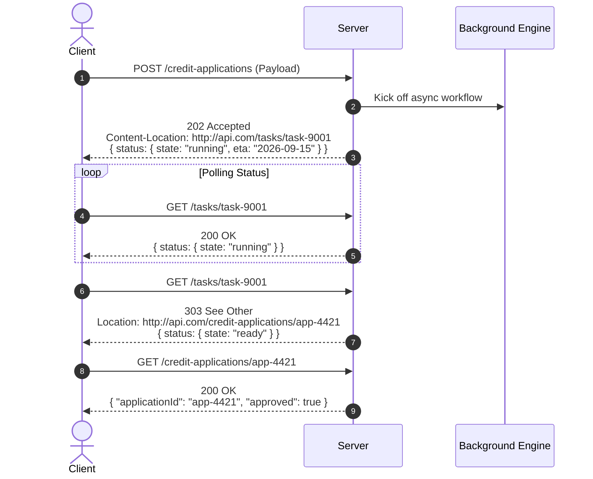

# WSO2 REST API Design Guidelines - Comprehensive Specification

## Origin & Authorship
* **Authors**: Prof. Dr. Frank Leymann, Joseph Fonseka, Sanjeewa Malalgoda, Nuwan Dias, Sameera Medagammaddegedara, Malintha Amarasinghe.
* **Organization**: WSO2 (Architecture of Application Systems).
* **Maturity Level**: Level 2 of the Richardson Maturity Model (URI resources, HTTP methods, status codes, headers, and pragmatic hypermedia).

---

## 1. The 7-Step REST API Design Methodology

WSO2 defines a sequential 7-step engineering approach for deriving a REST API from business concepts:

```
Create Data Model ──> Derive Resources ──> Decide on Representations ──> Name Resources by URIs ──> Determine HTTP Methods ──> Determine Special Behavior ──> Design Error Models
```

### Principle: "Clients Win Over Data"
* The **domain data model** drives the internal implementation of the API.
* The **resource model** is driven by client interaction patterns.
* There is rarely a 1:1 mapping between database tables and REST resources. Instead, resources are synthesized to minimize client round trips and protect database consistency.

---

## 2. The 5 Core Resource Types

```
┌───────────────────────────────┬──────────────────────────────────────────────────────────────┬───────────────────────────────────────────────────────┐
│ Resource Type                 │ Definition & Invariant                                       │ Canonical Example                                     │
├───────────────────────────────┼──────────────────────────────────────────────────────────────┼───────────────────────────────────────────────────────┤
│ 1. Atomic Resource            │ Single business entity exchanged as a cohesive whole.        │ /customers/{customerId}                               │
│ 2. Collection Resource        │ Directory of atomic resources; acts as a member factory.     │ /products, /customers                                 │
│ 3. Composite Resource         │ Aggregate root holding multiple child entities.              │ /shopping-carts/{cartId} (cart + all line items)      │
│ 4. Controller Resource        │ Procedural action across multiple entities to maintain ACID. │ /funds-transfer, /shopping-carts/{id}/checkout        │
│ 5. Processing Function Res.   │ Computation or predefined partial update service.            │ /currencies/USD/convert, /products/{id}/reprice       │
└───────────────────────────────┴──────────────────────────────────────────────────────────────┴───────────────────────────────────────────────────────┘
```

### Why Controller Resources Are Essential:
If an operation requires updating multiple resources atomically (e.g. debiting Account A and crediting Account B, or emptying a cart while creating an order), leaving it to the client to make multiple separate HTTP calls causes distributed partial failures and broken data states. A **Controller Resource** exposes the procedural action as a single endpoint, keeping transaction rules encapsulated on the server.

### Why Processing Function Resources Avoid PATCH Pitfalls:
While `PATCH` modifies an existing resource, RFC 5789 requires instruction documents (like JSON Patch / Merge Patch) and strict atomicity. In enterprise environments, predefined **Processing Function Resources** (e.g., `POST /orders/{id}/cancel` or `POST /products/{id}/price`) provide clear semantic contracts and eliminate ambiguous partial document merging.

---

## 3. URI Design, Templates & Semantic Versioning

### 3.1. Base Path & Feature Codes
```
https://{host}/{feature-code}/[{sub-code}/]/{version}/{resource-path}
```
* Example: `https://apis.wso2.com/apim/publisher/v2.1/apis`
  * Feature code: `apim`
  * Sub-code: `publisher`
  * Version: `v2.1`

### 3.2. Semantic Versioning Rules
* Versions follow `v{major}.{minor}`.
* **Patch number is omitted** from URIs (patch changes fix internal bugs without changing interface signatures).
* **Minor number increments**: Non-breaking feature additions (backward-compatible).
* **Major number increments**: Breaking changes (mandatory parameters added, endpoints removed).
* **Sunset Rule**: Servers MUST support the current major version plus at least one previous major version. When an old major version is retired, the server responds with:
  ```http
  HTTP/1.1 301 Moved Permanently
  Location: https://apis.wso2.com/apim/v2.0/apis
  ```

### 3.3. Scoped Collections (URI Templates)
Collections that only exist in the context of a parent entity are scoped:
```http
GET /shopping-carts/{cart-id}/items/{item-id}
```
* `{cart-id}` and `{item-id}` are variables that resolve to instances.
* Avoid exposing global collections for tightly bound entities (e.g., no global `/cart-items` endpoint).

---

## 4. HTTP Verb Semantics & Safe / Idempotent Operations

| Method | Safe? | Idempotent? | Body in Request? | Response Code & Headers |
|:---|:---:|:---:|:---:|:---|
| **GET** | Yes | Yes | **No** (Must NOT include body) | `200 OK`, `ETag`, `Last-Modified` |
| **PUT** | No | Yes | **Yes** (Complete resource representation) | `200 OK` or `204 No Content` |
| **POST** | No | No | **Yes** (New resource or action parameters) | `201 Created` + `Location` + `ETag` + `Content-Location` |
| **DELETE**| No | Yes | No | `200 OK` or `204 No Content` (Subsequent: `404 Not Found`) |

### Strict PUT Rule:
A `PUT` request MUST completely substitute the target resource. Any field omitted from the `PUT` payload is assumed to be cleared/nullified. If the client wants to update only one field without fetching the whole object, a dedicated Processing Function Resource or conditional `PATCH` must be used.

---

## 5. Concurrency Control & Client Caching

### 5.1. Optimistic Concurrency Control (ETag & If-Match)
To prevent lost updates during concurrent edits:
1. Client fetches resource:
   ```http
   GET /products/31415 HTTP/1.1
   ```
   Server responds:
   ```http
   HTTP/1.1 200 OK
   ETag: "4562aae7732a56"
   Last-Modified: Wed, 06 Jan 2026 11:13:00 GMT
   ```
2. Client sends update with conditional header:
   ```http
   PUT /products/31415 HTTP/1.1
   If-Match: "4562aae7732a56"
   ```
3. If someone else changed the product in the meantime:
   ```http
   HTTP/1.1 412 Precondition Failed
   ```

### 5.2. Client-Side Caching (If-None-Match & If-Modified-Since)
1. Client sends cached ETag:
   ```http
   GET /products/31415 HTTP/1.1
   If-None-Match: "4562aae7732a56"
   ```
2. If unchanged on server:
   ```http
   HTTP/1.1 304 Not Modified
   ```
   *(No body transmitted, saving bandwidth and server compute).*

---

## 6. Complex Query Handling: GET vs. POST

### The URL Length Limitation Problem:
Browsers, proxies, and web servers enforce strict URI length limits (often 2048 to 8192 characters). When a client needs to execute complex nested filters, multi-field sorts, and projections:

```
filter=((price > 1000 AND status = 'in-stock') OR (price < 200 AND rating >= 4.5))
sort=(price ASC, delivery-date DESC)
projection=price,color,status,inventoryLevel
```

### The Processing Function Search Endpoint:
When queries exceed URI limits, WSO2 specifies a dedicated processing function resource using `POST`:
```http
POST /product-search HTTP/1.1
Host: apis.wso2.com
Content-Type: application/json

{
  "filter": {
    "or": [
      { "and": [{ "price": { "gt": 1000 } }, { "status": "in-stock" }] },
      { "and": [{ "price": { "lt": 200 } }, { "rating": { "gte": 4.5 } }] }
    ]
  },
  "sort": [
    { "field": "price", "direction": "ASC" },
    { "field": "deliveryDate", "direction": "DESC" }
  ],
  "projection": ["price", "color", "status", "inventoryLevel"]
}
```

---

## 7. Asynchronous Task Lifecycle (`202 Accepted` to `303 See Other`)

For operations that trigger asynchronous workflows (e.g. human approval, background calculations):



---

## 8. Standard Error Object Schema

WSO2 requires consistent error reporting for all `4xx` and `5xx` responses:

```yaml
Error:
  type: object
  required:
    - code
    - message
  properties:
    code:
      type: integer
      format: int64
      description: Application-specific error code.
    message:
      type: string
      description: Detailed summary of what went wrong.
    description:
      type: string
      description: Contextual explanation for developers.
    moreInfo:
      type: string
      format: uri
      description: Link to documentation troubleshooting guide.
    error:
      type: array
      items:
        $ref: '#/definitions/ErrorListItem'

ErrorListItem:
  type: object
  required:
    - code
    - message
  properties:
    code:
      type: integer
      format: int64
    message:
      type: string
      description: Specific field-level error description.
```
